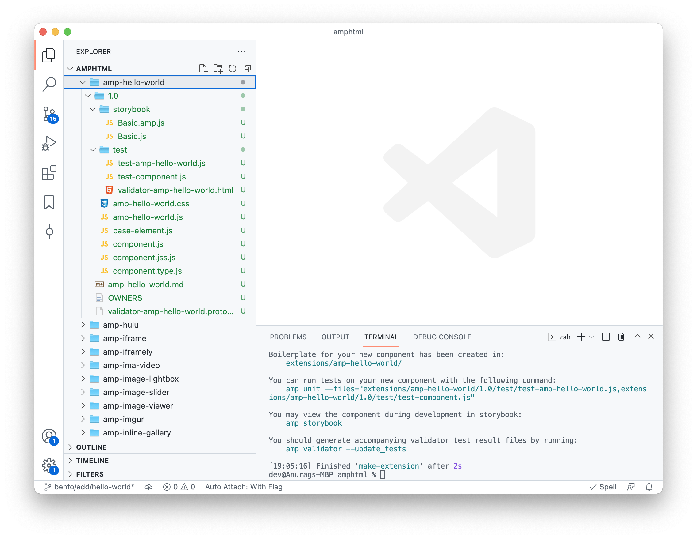
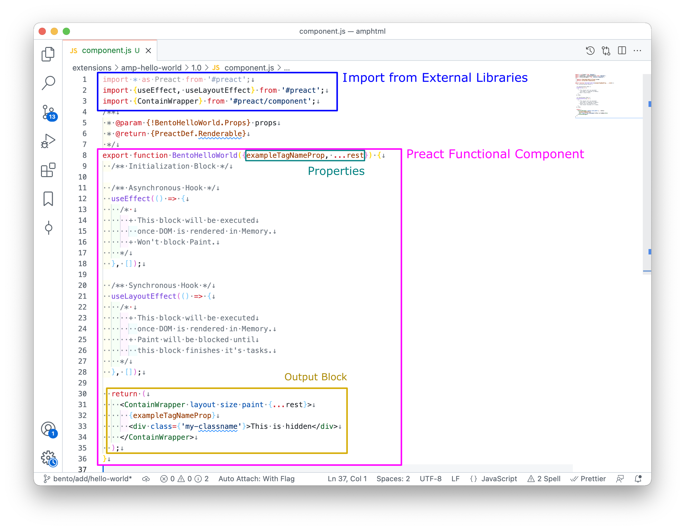

# Example 1: Hello World
Setup for development is covered in [previous tutorial](./setup.md). In this example, you will walk through a step-by-step guide to create, write and test your first `Hello World` Bento Component.

> This tutorial is intended for `beginner` and covers:
> - Create new Component
> - Write "Hello World"
> - Test Component

## Create
Let's create a new Bento Component:
```shell
amp make-extension --bento --name=hello-world
```

### Understand Directory Structure
Creating new component will generate `amp-hello-world`:


Before going ahead, let's understand basics of directory structure:
- Here, `storybook` directory provides environment to test out your Bento component into AMP and Preact environment without creating HTML page.
  - `Basic.amp.js` provides test environment for AMP while `Basic.js` provides test environment for Preact Component.
- `test` contains file for unit testing AMP and Preact component.
  -  `test-amp-hello-world.js` is for AMP unit-testing test while `test-component.js` is for Preact unit-test.
- `amp-hello-world.js` is your starting point for AMP Environment.
- `base-element.js` is your AMP-Preact Bridge.
- `component.js` is Preact Implementation for Component.
- `component.type.js` defines type-definition for Preact Component.

> To read more about directory structure, please [refer this guide](https://github.com/ampproject/amphtml/blob/main/docs/building-a-bento-amp-extension.md#directory-structure).

## Write "Hello World" Example

Goal of this example is to render (or show) `Hello World` in the browser.

Before writing example, let's understand basic structure of a Preact Functional Component. Open `component.js` and refer this figure:



As seen in above figure, a Bento Component is simply a Preact Functional Component. A Preact Functional Component takes properties (and component reference as optional) as parameter(s) and return Preact Element in JSX.
> Please refer [PreactJs: Functional Components](https://preactjs.com/guide/v10/components#functional-components) for more information.

Let's get back to example. To show `Hello World`, it should be return from Preact Functional Component as:

```diff
import * as Preact from '#preact';
import {
  useCallback,
  useEffect,
  useLayoutEffect,
  useMemo,
  useRef,
  useState,
} from '#preact';
import {ContainWrapper} from '#preact/component';

import {useStyles} from './component.jss';

/**
 * @param {!BentoHelloWorld.Props} props
 * @return {PreactDef.Renderable}
 */
export function BentoHelloWorld({exampleTagNameProp, ...rest}) {
  // Examples of state and hooks
  // DO NOT SUBMIT: This is example code only.
  const [exampleValue, setExampleValue] = useState(0);
  const exampleRef = useRef(null);
  const styles = useStyles();

  useCallback(() => {
    /* Do things */
  }, []);
  useEffect(() => {
    /* Do things */
  }, []);
  useLayoutEffect(() => {
    /* Do things */
  }, []);
  useMemo(() => {
    /* Do things */
  }, []);

  return (
    <ContainWrapper layout size paint {...rest}>
+     Hello World
      {exampleTagNameProp}
      <div class={`${styles.exampleContentHidden}`}>This is hidden</div>
    </ContainWrapper>
  );
}
```

Let's remove unnecessary code to make it simple to understand:

```javascript
import * as Preact from '#preact';
import {ContainWrapper} from '#preact/component';

/**
 * @param {!BentoHelloWorld.Props} props
 * @return {PreactDef.Renderable}
 */
export function BentoHelloWorld({...rest}) {
  return (
    <ContainWrapper layout size paint {...rest}>
      Hello World
    </ContainWrapper>
  );
}

```

Now, it is much cleaner to understand. Upon calling `BentoHelloWorld`, it will render `Hello World` on the scree.

> **What is `ContainWrapper`?**
> 
> The wrapper component that implements different "contain" parameters. This most often indicates that the element's size doesn't depend on its children (e.g. `contain:size`), but there might be other variances as well.
> 
> For more information, visit: https://developer.mozilla.org/en-US/docs/Web/CSS/contain


## Test

To test a Bento Component, storybook is provided. There are two types of storybook testing environment:
1. AMP Test Environment
2. Preact Functional Test Environment

Let's test component by:

`amp storybook`

You will see two storybook page:
- One with `9001` port which is AMP Test Environment
  - When this tutorial was written, AMP Storybook was disabled. Refer this PR for recent status: [#36780](https://github.com/ampproject/amphtml/pull/36780)
- Second with `9002` port which is Preact Component Test Environment


## Summary
In this example, you walked through creating your first `Hello World` Bento Component. Now, let's create an interactive greetings example in [next tutorial](example-2-greetings.md).