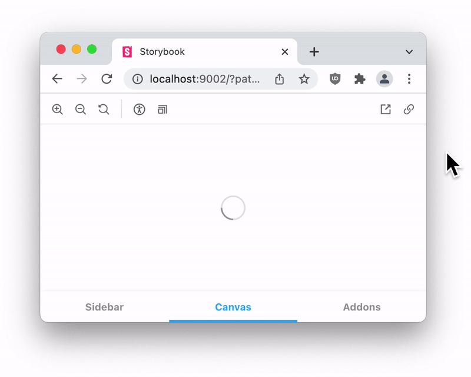
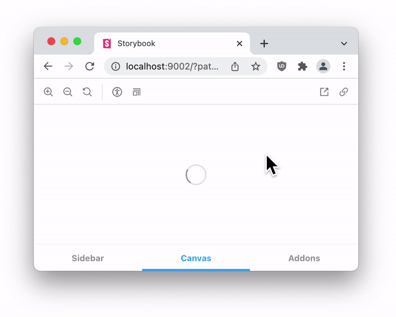

# Example 2: Greetings

[Example 1](./example-1-hello-world.md) covered basics of Bento Component, how to create and test Bento Component. In this example, you will learn two important hook of Preact: `useEffect` and `useLayoutEffect`.

> Objectives:
>
> -   `useEffect`
> -   `useLayoutEffect`
> -   `useState`


As per flowchart [WIP: flowchart], `useEffect` and `useLayoutEffect` will only be executed once DOM is created or updated in memory.

**`useEffect`**:

-   Executes **_asynchronously_** after DOM is created or updated.
-   It **_won't block_** paint.

**`useLayoutEffect`**:

-   Executes **_synchronously_** after DOM is created or updated.
-   **_Paint will be done only after `useLayoutEffect` finishes execution._**

> It is assumed that you have gone through [Example 1](./example-1-hello-world.md) to how to create a Bento Component. Use similar steps for this example.

Let's understand difference between `useEffect` and `useLayoutEffect` by Example to greet user based on time:

## `useEffect` Greeting Example

```javascript
import * as Preact from '#preact';
import {useEffect, useState} from '#preact';
import {ContainWrapper} from '#preact/component';

/**
 * @param {!BentoGreeting.Props} props
 * @return {PreactDef.Renderable}
 */
export function BentoGreeting({...rest}) {
  /* State Variables */
  const [greetMessage, setGreetMessage] = useState('Retrieving time...');

  /*
   * `useEffect` will execute in async manner once DOM is initialized in memory
   */
  useEffect(() => {
    // Retrieve Hour
    const date = new Date();
    const hour = date.getHours();

    if (hour < 12) {
      // Greet "Morning" for 0-11 hour
      setGreetMessage('Good Morning!');
    } else if (hour === 12) {
        // Greet "Noon" for exactly 12th hour
      setGreetMessage('Good Noon!');
    } else if (hour < 16) {
        // Greet "Morning" for 13-15 hour
      setGreetMessage('Good Afternoon!');
    } else if (hour < 21) {
        // Greet "Morning" for 16-20 hour
      setGreetMessage('Good Evening!');
    } else {
        // Greet "Night" for rest of the hours
      setGreetMessage('Good Night!');
    }
  }, []);

  return (
    <ContainWrapper layout size paint {...rest}>
      {greetMessage}
    </ContainWrapper>
  );
}
```

> **`useState`**: Allows to use state variable. In simle term, `useState` provides a way to efficiently re-render variable (when modified) wherever it is used without completely reloading component.
>
> `useState` always provides two variable as array. First, state variable to render and second one is always a `set` function to update the state variable. Whenever `set` updates state variable, it will only re-render DOM parts using respected state variable.
>
> Syntax:
>
> ```javascript
> [stateVariable, setStateVariableFunction] = useState( /* Initial Value (OPTIONAL) */ );
> ```

As per example, `greetMessage` is initially set to `Retrieving time...` which can be seen in below slowed-down output. Once, `useEffect` updates `greetMessage` using `setGreetMessage`, it will be reflected on screen:



## `useLayoutEffect` Greeting Example

```javascript
import * as Preact from '#preact';
import {useLayoutEffect, useState} from '#preact';
import {ContainWrapper} from '#preact/component';

/**
 * @param {!BentoGreeting.Props} props
 * @return {PreactDef.Renderable}
 */
export function BentoGreeting({...rest}) {
  /* State Variables */
  const [greetMessage, setGreetMessage] = useState('Retrieving time...');

  /*
   * `useLayoutEffect` will execute in sync manner once DOM is initialized in memory. Paint will only happen after execution of `useLayoutEffect`.
   */
  useLayoutEffect(() => {
    // Retrieve Hour
    const date = new Date();
    const hour = date.getHours();

    if (hour < 12) {
      // Greet "Morning" for 0-11 hour
      setGreetMessage('Good Morning!');
    } else if (hour === 12) {
        // Greet "Noon" for exactly 12th hour
      setGreetMessage('Good Noon!');
    } else if (hour < 16) {
        // Greet "Morning" for 13-15 hour
      setGreetMessage('Good Afternoon!');
    } else if (hour < 21) {
        // Greet "Morning" for 16-20 hour
      setGreetMessage('Good Evening!');
    } else {
        // Greet "Night" for rest of the hours
      setGreetMessage('Good Night!');
    }
  }, []);

  return (
    <ContainWrapper layout size paint {...rest}>
      {greetMessage}
    </ContainWrapper>
  );
}
```

`greetMessage` is initially set to `Retrieving time...` similar to `useEffect` example, but `useLayoutEffect` runs in synchronous manner and paint/render won't be happen till `useLayoutEffect` finishes it's task. Also, in this example `useLayoutEffect` updates `greetMessage` using `setGreetMessage`, which will be updated in memory DOM. Once `useLayoutEffect` finishes task, updated DOM from the memory will be painted to screen and thus `Retrieving time...` won't be seen even in slowed-down GIF:

`useLayoutEffect`:


## Summary

This example walked through usage, working and differences between `useEffect` and `useLayoutEffect`. In next tutorial, you will learn about `useCallback` with a counter example.

<hr/>
<a href="example-3-counter.md">Next: Example 3 - Counter</a>
