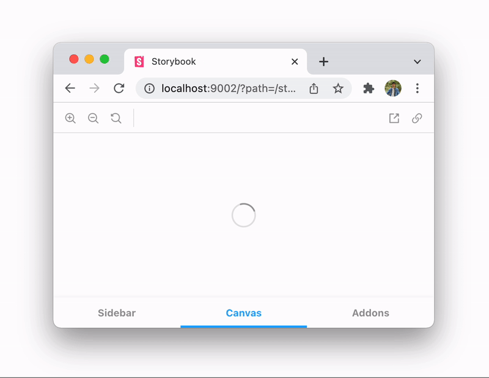
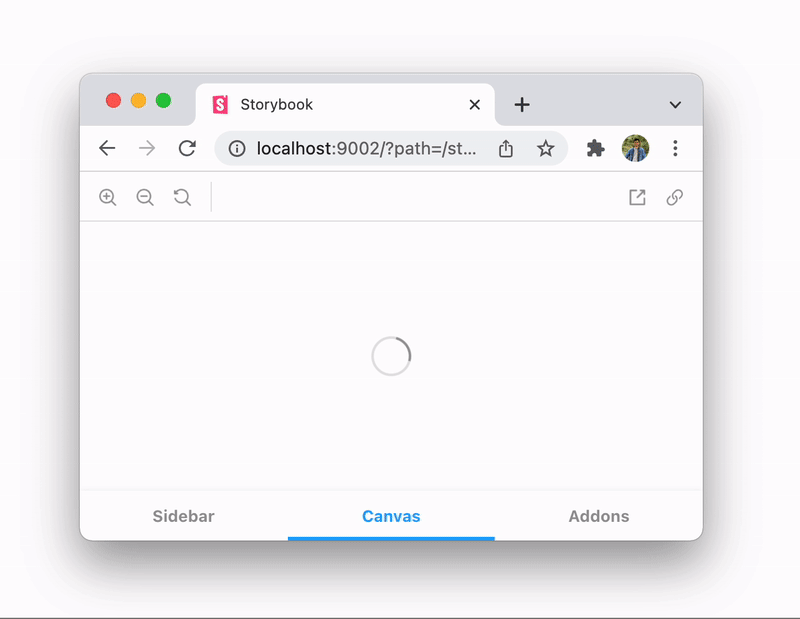

# Bento by Example [WIP - PoC]

Goal of this tutorial is to provide a step-by-step guide to learn, create, test & debug Bento Components. Tutorial start with setting up development enviroment and gradually walk through examples one-by-one.

## What is AMP?

AMP stands for Accelerated Mobile Pages, is an open source HTML framework developed by the AMP Open Source Project. It was originally created by Google. AMP project allows you to create mobile pages that load instantly, helping visitor better engage site.

AMP Components are react class components. They can be used as Document Service or a Renderable Component.

> Refer [AMP Development Site](https://amp.dev) for more information.

## What is Bento?

Bento Project can be said as a successor of the AMP project but with few flexibilities. Major advantage of a Bento Component is, it can be used on AMP as well as non-AMP pages. This makes Bento component versatile and easy to use.

Bento Component are simply Preact Functional Components. Preat is a lot faster and lighter than React. It can be used directly in the browser without any transpilation.

Bento Components can only be used as Renderable Components.

> Refer [BentoJs Development Site](https://bentojs.dev) for more information.

<!-- 1 - hello world - : create, write, test
2 - greetings - : useState, useEffect, useLayoutEffect
3 - counter - : useState, useCallback
4 - curr conv - : att map, jss, css
5 - carousel - : action, event, child mapping -->

## Table of Contents

-   [Setting up Environment](./setup.md)
    -   [CLA Signup](#cla-signup)
    -   [Clone & Setup Repository](#clone--setup-repository)
    -   [Visual Studio Code Extensions](#visual-studio-code-extensions)
-   [Directory Structure](#directory-structure)
-   [Bridge between AMP and Bento](#bridge-between-amp-and-bento)
-   [Execution Flow](#execution-flow)
-   [Example](#example)
    -   [Beginner](#beginner)
        -   [Example 1: Hello World](./example-1-hello-world.md)
        -   [Example 2: Greetings](./example-2-greetings.md)
        -   [Example 3: Counter](./example-3-counter.md)
        -   [Assignment 1](#assignment-1)
    -   [Intermediate](#intermediate)
        -   [Example 4: Currency Converter](./example-4-currency-converter.md)
        -   [Assignment 2](#assignment-2)
    -   [Advance](#advance)
        -   [Example 5: Carousel](./example-5-carousel.md)
        -   [Assignment 3](#assignment-3)
-   [Storybook](#storybook)
-   [Unit Tests](#unit-tests)
-   [References](#references)
-   [FAQ](#faq)

## Example

> Summarize example structure that is divided into three major parts: Beginner, Intermediate and Advance

### Beginner

> Creating, Testing & Debugging summary with step-by-step explanation of command-line.
>
> Beginner makes it easy for developer to get familiar with Environment and with the basics of Bento Component.

#### Example 1: Hello World

This example provides step-by-step guide to create your first Bento "Hello World" component.

| Tutorial | [example-1-hello-world.md](./example-1-hello-world.md)                                                                                        |
| -------- | --------------------------------------------------------------------------------------------------------------------------------------------- |
| Sample   | [rtCamp/amphtml/tree/bento/sample/extensions/amp-hello-world](https://github.com/rtCamp/amphtml/tree/bento/sample/extensions/amp-hello-world) |

#### Example 2: Greetings

Greet user based on their local time.

| Tutorial | [example-2-greetings.md](./example-2-greetings.md)                                                                                      |
| -------- | --------------------------------------------------------------------------------------------------------------------------------------- |
| Sample   | [rtCamp/amphtml/tree/bento/sample/extensions/amp-greeting](https://github.com/rtCamp/amphtml/tree/bento/sample/extensions/amp-greeting) |

#### Example 3: Counter

> `useState`, `useCallback`, `property` mapping

| Tutorial | [example-3-counter.md](./example-3-counter.md)                                                                                        |
| -------- | ------------------------------------------------------------------------------------------------------------------------------------- |
| Sample   | [rtCamp/amphtml/tree/bento/sample/extensions/amp-counter](https://github.com/rtCamp/amphtml/tree/bento/sample/extensions/amp-counter) |

#### Assignment 1

> Each part(here, Beginner) of the example ends with Assignment. This assignment are provided based on the example provided on the part (here, Beginner).
>
> To be decided!

### Intermediate

> Get familiar `attributes`, `css` and `jss`

#### Example 4: Currency Converter

> Learn `attributes`, `css`, `jss`, `useMemo` for HTTP API call

| Tutorial | [example-4-currency-converter.md](./example-4-currency-converter.md)                                                                                        |
| -------- | ----------------------------------------------------------------------------------------------------------------------------------------------------------- |
| Sample   | [rtCamp/amphtml/tree/bento/sample/extensions/amp-currency-converter](https://github.com/rtCamp/amphtml/tree/bento/sample/extensions/amp-currency-converter) |

#### Assignment 2

-   Add `auto-increment` and `initial-value` attribute for `Example 3`
-   Add appropriate styling to `Example 3` & `Example 4`

### Advance

> Get familiary with API Functions & Events

#### Example 5: Carousel

> `forwardRef` Example (TBD)
>
> Dynamic Components (nesting of Components)
>
> Selecting child using `props`

| Tutorial | [example-5-carousel.md](./example-5-carousel.md) |
| -------- | ------------------------------------------------ |
| Sample   | WIP                                              |

#### Assignment 3

> To be decided!

## Storybook

> Explanation of how to write and test storybook example.

## Unit Tests

> Explanation of how to write and test Unit-tests for `React` and `Preact`

## References

-   AMP Commands
    -   > Summarize important `amp` commands for creating, validating, testing & debugging
-   Checks before sending PR
-   Function explanation with use-case
-   Storybook and TestCases
-   Tools for Performance Analysis (for testing of custom designed Bento Component)
-   Limitation

## FAQ

-   Avoid DOM API (instead use Declarative Preact)
-   Certified vs Non-Certified
-   Isolated usage without AMP
-   `useEffect` vs `useLayoutEffect`
