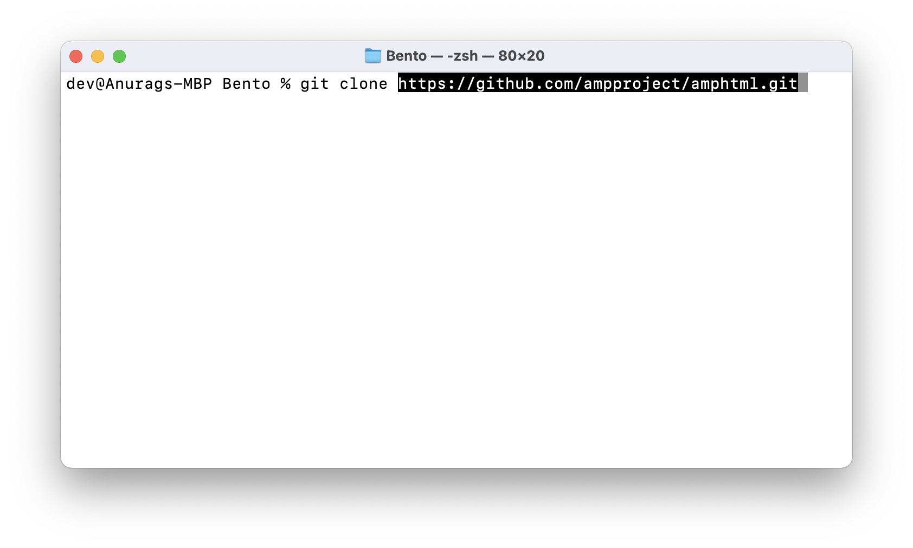
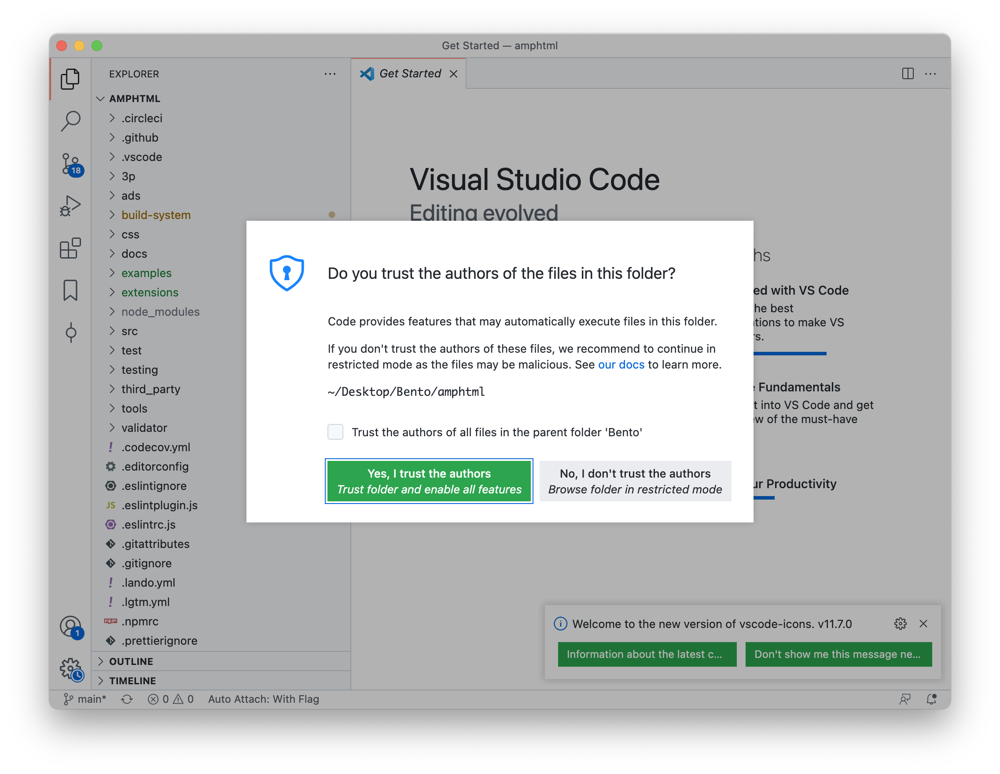

# Bento by Examples
> Detailed writeup of What is AMP & Bento? Benefits of Bento? What is Preact?

1 - hello world - : create, write, test
2 - greetings   - : useState, useEffect, useLayoutEffect
3 - counter     - : useState, useCallback
4 - curr conv   - : att map, jss, css
5 -  carousel   - : action, event, child mapping

## Table of Contents
- [Bento by Examples](#bento-by-examples)
  - [Table of Contents](#table-of-contents)
  - [Setting up Environment](#setting-up-environment)
    - [CLA Signup](#cla-signup)
    - [Clone & Setup Repository](#clone--setup-repository)
    - [Visual Studio Code Extensions](#visual-studio-code-extensions)
  - [Directory Structure](#directory-structure)
  - [Bridge between AMP and Bento](#bridge-between-amp-and-bento)
  - [Execution Flow](#execution-flow)
  - [Examples](#examples)
    - [Beginner](#beginner)
      - [Example 1: Hello World](#example-1-hello-world)
        - [Create Bento Component:](#create-bento-component)
      - [Create a Branch](#create-a-branch)
      - [Write Code](#write-code)
      - [Storybook Test](#storybook-test)
      - [Example 2: Greetings](#example-2-greetings)
      - [Example 3: Counter](#example-3-counter)
      - [Example 4: Calculator](#example-4-calculator)
      - [Assignment 1](#assignment-1)
    - [Intermediate](#intermediate)
      - [Example 5: Currency Converter](#example-5-currency-converter)
      - [Assignment 2](#assignment-2)
    - [Advance](#advance)
      - [Example 6: Carousel](#example-6-carousel)
      - [Assignment 3](#assignment-3)
  - [Storybook](#storybook)
  - [Unit Tests](#unit-tests)
  - [References](#references)
  - [FAQ](#faq)

## Setting up Environment
Let's setup and get started with Bento.

### CLA Signup
First step to get started with the project is to signup [Contributor License Agreement](https://github.com/ampproject/amphtml/blob/0320666d03db37c4e0e363b55f828aa807ae321c/validator/cpp/htmlparser/CONTRIBUTING.md#contributor-license-agreement).
> Contributions to this project must be accompanied by a Contributor License Agreement. You (or your employer) retain the copyright to your contribution; this simply gives us permission to use and redistribute your contributions as part of the project. Head over to https://cla.developers.google.com/ to see your current agreements on file or to sign a new one.
>
>You generally only need to submit a CLA once, so if you've already submitted one (even if it was for a different project), you probably don't need to do it again.

### Clone & Setup Repository

Clone `ampproject/amphtml` project using following command:

`git clone https://github.com/ampproject/amphtml.git`



Once project is cloned, go to `amphtml` directory and install dependencies:

```shell
cd amphtml/
npm install
```


### Visual Studio Code Extensions

> List important VSCode Extensions to simplify development.

## Directory Structure
> Summarize directory structure & file usage for component, test-case and examples

## Bridge between AMP and Bento
> Represent & explain execution flow of AMP-Bento Bridge (created on miro) with commonly used mapping properties 


## Execution Flow
> Represent & explain execution flow of Bento Component (created on miro)


## Examples
> Summarize example structure that is divided into three major parts: Beginner, Intermediate and Advance

### Beginner
> Creating, Testing & Debugging summary with step-by-step explanation of command-line.
>
> Beginner makes it easy for developer to get familiar with Environment and with the basics of Bento Component.

#### Example 1: Hello World

This example provides step-by-step guide to create your first Bento "Hello World" component.

Let's start by creating a new Bento Component.
##### Create Bento Component:

`amp make-extension --bento --name=amp-hello-world --nocss --nojss`

This will create `amp-hello-world\1.0` directory into `extensions\` as:


Understand directory structure:
- Here, `storybook` directory provides environment to test out your Bento component into AMP and Preact environment without creating HTML page.
  - `Basic.amp.js` provides test environment for AMP while `Basic.js` provides test environment for Preact Component.
- `test` contains file for unit testing AMP and Preact component.
  -  `test-amp-hello-world.js` is for AMP unit-testing test while `test-component.js` is for Preact unit-test.
- `amp-hello-world.js` is your starting point for AMP Environment.
- `base-element.js` is your AMP-Preact Bridge.
- `component.js` is Preact Implementation for Component.
- `component.type.js` defines type-definition for Preact Component.

To read more about directory structure, please [refer this guide](https://github.com/ampproject/amphtml/blob/main/docs/building-a-bento-amp-extension.md#directory-structure).

#### Create a Branch

Start Visual Studio Code and open cloned repository `amphtml`.

> If asked for "Trust Authors", select "Yes":
> 

Whenever you wish to add/update/delete on the repository, it is important not to directly work on `main` branch. Instead, create a new branch with a meaningful name to represent the update it is proposing.

In this example case, we can create a branch named: `bento/add/hello-world`


Now, everything we add/update/delete will be executed on this new branch `bento/add/hello-world`.

#### Write Code

A Bento Component is a Preact functional component. Here's basic structure of a Bento Component:


In context of this example, "Hello World" should be rendered in ViewPort.

Contents that need to be on ViewPort should be written in `Output Block`.

So, file `extensions/amp-hello-world/1.0/component.js` should be:

```jsx
import * as Preact from '#preact';
import {useEffect, useLayoutEffect} from '#preact';
import {ContainWrapper} from '#preact/component';
/**
 * @param {!BentoHelloWorld.Props} props
 * @return {PreactDef.Renderable}
 */
export function BentoHelloWorld({...rest}) {
  /** Initialization Block */

  /** Asynchronous Hook */
  useEffect(() => {
    /* 
      + This block will be executed
        once DOM is rendered in Memory.
      + Won't block Paint.
    */
  }, []);

  /** Synchronous Hook */
  useLayoutEffect(() => {
    /* 
      + This block will be executed
        once DOM is rendered in Memory.
      + Paint will be blocked until
        this block finishes it's tasks.
    */
  }, []);

  return (
    <ContainWrapper layout size paint {...rest}>
      Hello World
    </ContainWrapper>
  );
}
```

#### Storybook Test

To test this example, use following command in terminal to start storybook environment:

`amp storybook`

You will see two storybook page:
- One with `9001` port which is AMP Test Environment
  - When this tutorial was written, AMP Storybook was disabled. Refer this PR for recent status: [#36780](https://github.com/ampproject/amphtml/pull/36780)
- Second with `9002` port which is Preact Component Test Environment


> Summarize example 1...

#### Example 2: Greetings

Greet user based on their local time.

#### Example 3: Counter
> `useState`, `useCallback`, `property` mapping

#### Example 4: Calculator
> `useCallback` for multiple elements

#### Assignment 1
> Each part(here, Beginner) of the example ends with Assignment. This assignment are provided based on the examples provided on the part (here, Beginner).
>
> To be decided!

### Intermediate
> Get familiar `attributes`, `css` and `jss` 

#### Example 5: Currency Converter
> Learn `attributes`, `css`, `jss`, `useMemo` for HTTP API call

#### Assignment 2
- Add `auto-increment` and `initial-value` attribute for `Example 3`
- Add styling to `Example 3` & `Example 4`

### Advance
> Get familiary with API Functions & Events

#### Example 6: Carousel
> `forwardRef` Example (TBD)
> 
> Dynamic Components (nesting of Components)
> 
> Selecting child using `props`

#### Assignment 3
> To be decided!

## Storybook
> Explanation of how to write and test storybook examples.

## Unit Tests
> Explanation of how to write and test Unit-tests for `React` and `Preact`

## References
- AMP Commands
  - > Summarize important `amp` commands for creating, validating, testing & debugging
- Checks before sending PR
- Function explanation with use-case
- Storybook and TestCases
- Tools for Performance Analysis (for testing of custom designed Bento Component)
- Limitation

## FAQ
- Avoid DOM API (instead use Declarative Preact)
- Certified vs Non-Certified
- Isolated usage without AMP
- `useEffect` vs `useLayoutEffect`