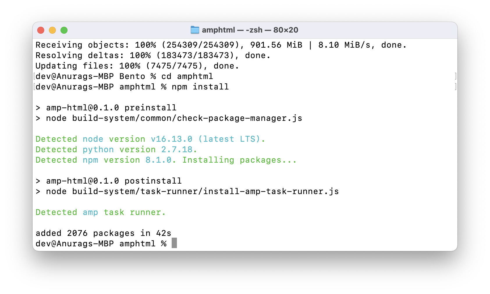

# Setup
Let's setup and get started with Bento.

## CLA Signup
First step to get started with the project is to signup [Contributor License Agreement](https://github.com/ampproject/amphtml/blob/0320666d03db37c4e0e363b55f828aa807ae321c/validator/cpp/htmlparser/CONTRIBUTING.md#contributor-license-agreement).
> Contributions to this project must be accompanied by a Contributor License Agreement. You (or your employer) retain the copyright to your contribution; this simply gives us permission to use and redistribute your contributions as part of the project. Head over to https://cla.developers.google.com/ to see your current agreements on file or to sign a new one.
>
>You generally only need to submit a CLA once, so if you've already submitted one (even if it was for a different project), you probably don't need to do it again.

## Clone & Setup Repository

Clone `ampproject/amphtml` project using following command:

`git clone https://github.com/ampproject/amphtml.git`

Once project is cloned, go to `amphtml` directory and install dependencies:

```shell
cd amphtml/
npm install
```

Once installation done, you may see:



## Visual Studio Code Extensions (Optional)
Some of good (but not mandatory) Visual Studio Code Extension that make development easier.
- Alphabetical Sorter ([ue.alphabetical-sorter](https://marketplace.visualstudio.com/items?itemName=ue.alphabetical-sorter))
- ESLint ([dbaeumer.vscode-eslint](https://marketplace.visualstudio.com/items?itemName=dbaeumer.vscode-eslint))
- Prettier - Code formatter ([esbenp.prettier-vscode](https://marketplace.visualstudio.com/items?itemName=esbenp.prettier-vscode))

## Summary
Setup is ready! Let's create first Bento Component by an [Example: Hello World](./example-1-hello-world.md).