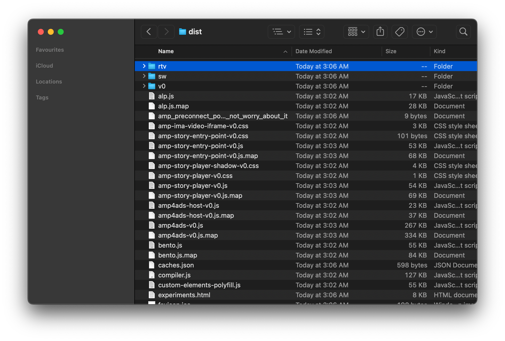
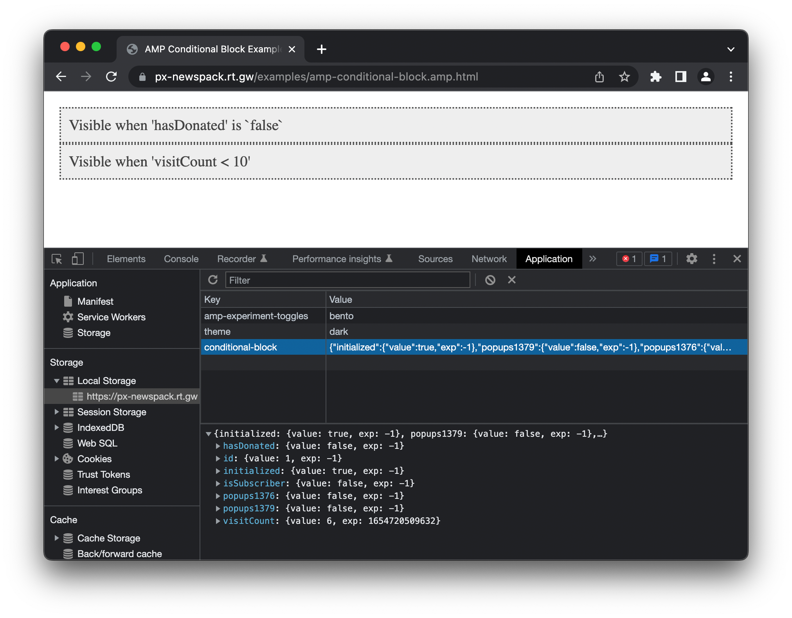
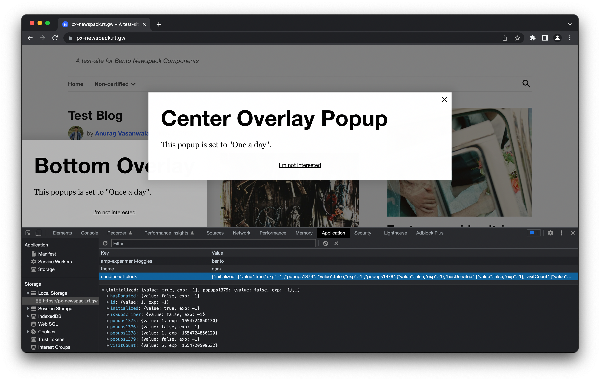

# Self-hosted Testing

This guide is designed the incontext of testing and analysing Newspack Popups with `amp-conditional-block`.

Also, this guide is divided into two section:
1. Build "AMP Runtime" for self-hosted server
2. Usage (stand-alone and Newspack Popups)

## Build AMP Runtime (for self-hosted server)

Clone experimental AMPHTML   repository:

```shell
# Clone repository
git clone https://github.com/rtCamp/amphtml.git

# Switch to experimental component branch
git checkout experimental/bento/conditional-block
```

Now, goto the the cloned directory, initialize repository and install dependencies:

```shell
cd amphtml/

# Install dependencies
npm i
```

Update testing host with your server domain:

```shell
export AMP_TESTING_HOST="px-newspack.rt.gw"
```

> Here, replace `px-newspack.rt.gw` with your self-hosted server domain name.

Add `custom-config.json` into `amphtml/build-system/global-configs/custom-config.json`:

```json
{
    "cdnUrl": "https://px-newspack.rt.gw/dist",
    "version-locking": 0
}
```

> Here, replace `px-newspack.rt.gw` with your self-hosted server domain name.


Build and prepare "AMP Runtime":

```shell
# Clean existing build
amp clean

# Prepare new build
amp build --fortesting --config=prod

# Prepare new dist
amp dist --fortesting --config=prod
```

Now, copy `dist` directory to a temporary location (lets assume, we have copied to `temp/dist`) before next step.

Prepare `release`:

```shell
amp release
```

Finally, open built `release` directory and copy `rtv` from `org-cdn` directly into temporarly copied `dist` directory as:



Lastly, make a zip of `temp/dist` and upload it to your self-hosted server in root of your `www` directory, so that `dist` can be accessible as:

```
https://px-newspack.rt.gw/dist/v0/amp-conditional-block-1.0.js
```

> Here, replace `px-newspack.rt.gw` with your self-hosted server domain name.

## Usage: Stand-alone Webpage



```html
<!DOCTYPE html>
<html ⚡ lang="en">
  <!-- prettier-ignore -->
  <head>
    <meta charset="utf-8" />
    <link rel="canonical" href=".">
    <title>AMP Conditional Block Example</title>
    <meta
      name="viewport"
      content="width=device-width,minimum-scale=1,initial-scale=1"
    />
    <style amp-boilerplate>body{-webkit-animation:-amp-start 8s steps(1,end) 0s 1 normal both;-moz-animation:-amp-start 8s steps(1,end) 0s 1 normal both;-ms-animation:-amp-start 8s steps(1,end) 0s 1 normal both;animation:-amp-start 8s steps(1,end) 0s 1 normal both}@-webkit-keyframes -amp-start{from{visibility:hidden}to{visibility:visible}}@-moz-keyframes -amp-start{from{visibility:hidden}to{visibility:visible}}@-ms-keyframes -amp-start{from{visibility:hidden}to{visibility:visible}}@-o-keyframes -amp-start{from{visibility:hidden}to{visibility:visible}}@keyframes -amp-start{from{visibility:hidden}to{visibility:visible}}</style>
    <noscript><style amp-boilerplate>body{-webkit-animation:none;-moz-animation:none;-ms-animation:none;animation:none}</style></noscript>
    <style amp-custom="">
      body { padding: 20px; } 
      section { color: #444; background: #eee; font-size: 120%; border: 2px dotted; padding: 10px; }
    </style>
    <script
      async
      custom-element="amp-conditional-block"
      src="https://px-newspack.rt.gw/dist/v0/amp-conditional-block-1.0.js"
    ></script>
    <script async src="https://px-newspack.rt.gw/dist/amp.js"></script>
    <script>
      (self.AMP = self.AMP || []).push(function (AMP) {
        AMP.toggleExperiment('bento', true);
      });
    </script>
    <script id="conditional-block" type="application/json">
      {
        "top_level": {
          "default_operation": {
            "type": "GET",
            "url": "https://px-newspack.rt.gw/examples/sample-1.json",
            "options": {
              "method": "GET"
            },
            "parameters": "0280"
          }
        },
        "hasDonated": {
          "default_operation": {
            "type": "variable",
            "operation": "hasDonated = false"
          },
          "condition": "hasDonated",
          "true_operation": null,
          "false_operation": {
            "type": "GET",
            "url": "https://px-newspack.rt.gw/examples/sample-1.json",
            "options": {
              "method": "GET"
            },
            "parameters": {
              "_ga": "$COOKIE['_ga']",
              "visitCount": "$LOCALSTORAGE['visitCount']"
            }
          },
          "expiration": "weekly"
        },
        "visitCount": {
          "default_operation": {
            "type": "variable",
            "operation": "visitCount = 5"
          },
          "condition": "visitCount < 10",
          "true_operation": {
            "type": "variable",
            "operation": "visitCount = visitCount + 1"
          },
          "false_operation": null,
          "expiration": "daily"
        }
      }
    </script>
  </head>
  <body>
    <amp-conditional-block> </amp-conditional-block>
    <section conditional-block="hasDonated" hidden>
      Visible when 'hasDonated' is `true`
    </section>
    <section conditional-block="NOT hasDonated" hidden>
      Visible when 'hasDonated' is `false`
    </section>
    <section conditional-block="visitCount < 10" hidden>
      Visible when 'visitCount < 10'
    </section>
  </body>
</html>
```

## Usage: Newspack Popups



### Clone

SSH into your server and go to WordPress plugins directory `public/wp-content/plugins`

```shell
# Goto your website's plugin directory
cd wp-content/plugins
```

Now, clone experimental `Newspack Popups` repository, switch to testing branch and initialise:

```shell
# Clone repository
git clone https://github.com/rtCamp/newspack-popups.git

# Goto 'Newspack Popups' directory
cd newspack-popups

# Switch to experimental branch
git checkout  experiment/bento/conditional-block

# Install dependencies
npm i

# Clean any existing dist build
npm run clean

# Build new dist using 'newspack-scripts'
npm run build
```

### Install 'Newspack' Plugin

Install `Newspack` plugin from [official release](https://github.com/Automattic/newspack-plugin/releases) page.

### Setup plugin

Now, activate `Newspack` and `Newspack Popups` plugin.

To test `Newspack Popups` with `amp-conditional-block`, create a new Popup, visit site and analyse localStorage for various frequency.

### Known Issues

Experimental `Newspack Popups` plugin is not compatible with following plugins:
- AMP
- PWA

Please disable above plugins.

> AMP by-default adds "AMP Runtime" from official AMP CDN. In case of this component, it is experimental and won't be available from official AMP CDN and thus it is required to disable it so `Newspack Popups` can enqueue scripts from `https://<self-hosted-server>/dist`.